# Related Work

## The Lottery Ticket Hypothesis

When training neural networks, pruning away unneeded weights allow for the improvement of
the models by decreasing their size while also improving their performance. However, after
pruning a model, the resulting subnetwork is unable to be further trained or improved upon due
to its sparsity. If it were attempted, it was extremely difficult to do so, and often resulted in slower
learning and lower accuracy than the original model. As an answer to this, in 2009, Frankle and
Carbin proposed the lottery ticket hypothesis.

The Lottery Ticket Hypothesis, as described by Frankle and Carbin, is the idea that a
randomly-initialized, dense neural network will contain a subnetwork that could match the test
accuracy of the original network after training as much as or less than the original model.
These trainable subnetworks are referred to as "winning tickets".

The secret to discovering these winning tickets lies within its pruning. Normally, when pruning
low magnitude weights from a neural network, the remaining weights are readjusted by fine
tuning the model with further training.

Imagine you had a randomly initialized dense model:  
$f(x; \theta_0)$, where $\theta_0$ represents a random set of initial weights.

You then train the model for $j$ iterations, changing the weights to $\theta_j$.

You then create a binary mask to indicate whether a weight has been pruned from the model,
and then proceed to prune the model as normal.

The model parameters are then reset (from $\theta_j$ to $\theta_0$); creating the final winning ticket:  
$f(x; m \odot \theta_0)$.

The study by Frankle and Carbin goes over two different pruning methods: one-shot pruning,
and iterative pruning.

One-shot pruning is a process where the above algorithm is followed and completed once,
allowing for a simple, and somewhat quick training process. Meanwhile, in iterative pruning, the
pruned network is reinitialized and then the algorithm is repeated, training/pruning again for $k$
iterations.

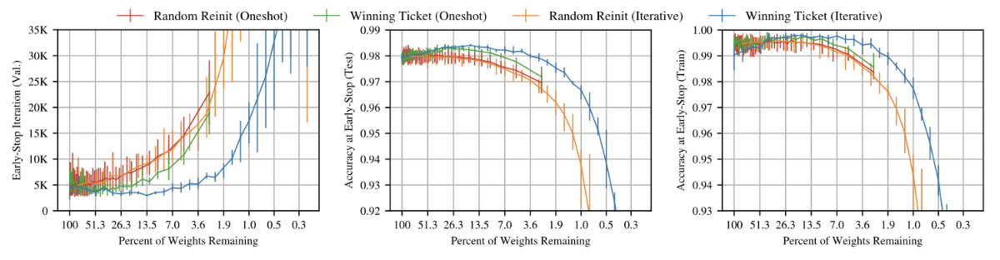

The above set of graphs taken from Frankle and Carbin, show that training the winning ticket
with iterative pruning is able to consistently outperform all other models, especially at extremely
high sparsity levels.

While one-shot pruning performs worse than iterative pruning, it is still able to outperform the
original models, in which the weights were reinitialized after pruning.

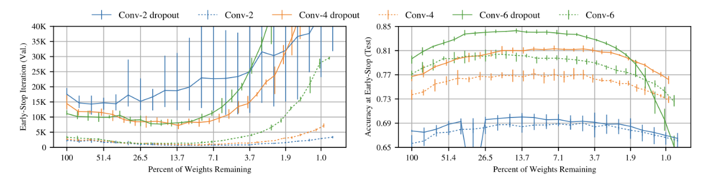

It was also found that the lottery ticket hypothesis could be used conjunctively. When tested
alongside iterative pruning, it was found that both the learning speed, as well as the overall
accuracies of the model, as shown in the figures above (also from Frankle and Carbin).

Because the initialization of a winning ticket is reliant on the initial structure of the deep neural
network, Frankle and Carbin hypothesized that the structure of winning tickets encodes an
inductive bias customized to the learning task at hand. Previous studies have shown that a deep
network's structure can hold an inductive bias within its structure that allows it to separate and
determine data more efficiently than a shallow network; leading to the idea that a similar effect
may apply with the structure of winning tickets.

A major strength of the Lottery Ticket Hypothesis is that it demonstrates the existence of highly
efficient subnetworks within overparameterized models, which allowed the usage of a pruned
subnetwork to be trained and pruned further; allowing for even more compact, efficient neural
network models to be produced.

However, the main limitation of the approach is its high computational cost. Iterative pruning
requires repeated cycles of full training and pruning, making it expensive and impractical for
very large architectures; and while one-shot pruning was a workaround for this, there was still a
noticeable performance drop in the final product. Additionally, the method is highly sensitive to
the original random initialization of the original model, suggesting that it may be possible for
some dense models to "get unlucky" and initialize without winning tickets.

---

## Random Out

Cohen, Lo, and Ding describe a phenomenon they call The Filter Lottery. The Filter Lottery is
the idea that the random numbers created by a random seed are biased, and can determine
how well your model will train. On certain architectures, simply changing the initialization seed
can end up significantly changing the outcome of a model; between a successful training and
total failure.

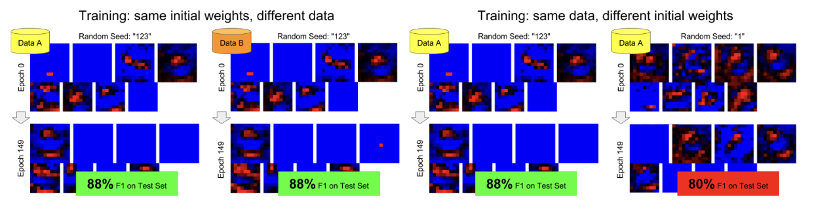

This led the writers to believe that bad seeds can end up inhibiting the learning of useful filters.
These filters are said to be "abandoned" by the network. Wider networks, due to having more
filters, often had better performance and were less likely to be affected by these abandoned
filters.

This unreliable initialization caused the authors to propose a method called RandomOut. While
training a neural network, RandomOut would score all filters using something called the
Convolutional Gradient Norm (this estimates how much a given filter would learn):

$$\text{CGN}(k) = \sum_i \left| \frac{\partial L}{\partial w_{k,i}} \right|$$

Here, the gradients of the loss with respect to each weight in a given filter $k$ are all added
together in order to see exactly how much influence filter $k$ has on the model. If the number is
below a predefined threshold, the filter is determined to be abandoned. The filter would then be
replaced by a new filter set with random values, allowing the weights to learn a completely
different filter.

While there are other solutions available for unreliable seeds such as BatchNorm, RandomOut
requires no architectural change or inference-time overhead. RandomOut is also able to prevent
possible training failures while significantly reducing variance across multiple different random
initializations.

Unfortunately, experiments are limited to CraterCNN and a small Inception-V3 variant. This
means that it has only been tested with smaller networks. Behavior on large-scale architectures
is unknown and may not have as much of an impact, as larger networks have significantly more
filters.

RandomOut actually has a few interesting similarities with the lottery ticket hypothesis. More
specifically, both papers place a heavy importance on the initialization of a model (such as the
embedded bias of the initial model structure, and the random numbers generated by a seed).
However, the lottery ticket hypothesis may not be very compatible with RandomOut. This is
because LTH places significance on the original structure of a trained model and its weight
values. Meanwhile, RandomOut places more emphasis on the actual functionality of the model.
If a filter looks abandoned, it is reinitialized, possibly altering the formation of a winning ticket.

---

## Training Deep FeedForward Neural Networks

Since 2006, there has been a significant increase in the training of deep neural networks.
However, these new developments in deep learning were done using new algorithms rather
than older initialization and training schemes from standard feedforward networks. The paper:
**Understanding the difficulty of training deep feedforward neural networks**, by Glorot and Bengio
simply aimed to understand why this was. Specifically, they wanted to know why SGD and
random initialization were doing so poorly.

One of Glorot and Bengio's ideas was that commonly used activation functions may have been
causing optimization problems within deep networks. To test this, they trained a deep model
using 3 different activation functions: sigmoid, tanh, and softsign.

The biases for the deep model were set to 0, and the weights at each layer were determined
with the heuristic function:

$$W_{ij} \sim U\left[-\frac{1}{\sqrt{n}}, \frac{1}{\sqrt{n}}\right]$$

where U[-a, a] is the uniform distribution between -a and a, and n is the size of the previous layer. 
(this essentially means W is taking a random value between -a and a).

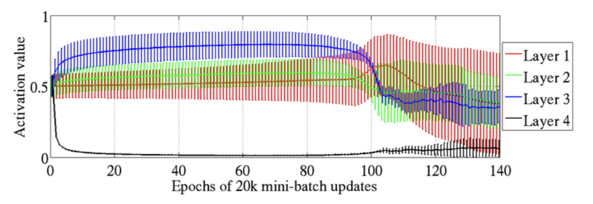

The above image displays the results for sigmoid, and here we can see that all the activation
values for the hidden layer of the deep model were almost instantly pushed to 0; a clear
indication for a saturated sigmoid (when sigmoid is set to its maximum or minimum value). We
can see that this is also a problem for the other layers as well, as the activation values for all
other layers converge towards 0; albeit more gradually than the hidden layer.

Glorot and Bengio hypothesized that this happened due to the random initialization of the
weights along with a hidden unit outputting a 0 value.

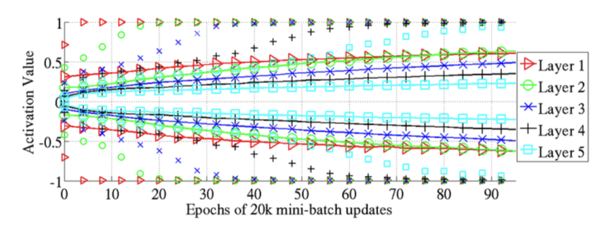

With tanh, because it is symmetrical around 0, it would not have the saturation problems
sigmoid had. However, as seen from the above figure, when applied to deep the network, tanh
had its own strange saturation problem. Why this is happening is unknown.

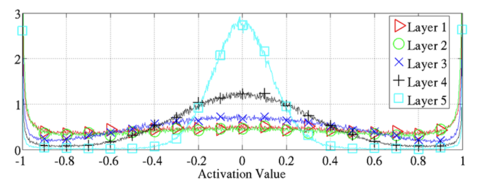

The last activation function that was looked at was softsign. This also faced saturation
problems, where its activation values would all slowly approach maximum values over time.

These results brought Glorot and Bengio to the conclusion that the choice of activation functions
were a major reason why deep networks were historically very hard to train, and why few
modern implementations were done with the use of these old activation functions; as many of
them appear to face heavy saturation problems, whether it is due to exploding or vanishing
gradients.

Similarly to both LTH and RandomOut, this paper places a lot of focus on the initialization of
models (in this case the activation). However, there was a large difference in the scope and
reasoning that these papers viewed model initialization. Glorot & Bengio aim to make dense
networks trainable with old methods/activations and found that not only was it not efficient to do
so, the models were unable to train due to severe saturation errors caused within every tested
activation value. Meanwhile, LTH discovers that only small subsets of weights need to be
correctly initialized, and nothing special needs to be done to initialize a LTH model.

There are scope differences between this paper and RandomOut as well. This paper looks at all
deep models (addressing a global problem), while RandomOut addresses a smaller
categorization of models that may have bad seeds. Even then, there are many more models
with working seeds, making RandomOut cover a much more specialized problem than this
paper.

---

## Stabilizing the Lottery Ticket Hypothesis

While the Lottery Ticket Hypothesis managed to solve the problem of being unable to train
pruned architectures, this solution only works for small vision benchmarks such as Tiny
ImageNet. However, when the LTH is applied to larger/deeper networks, the LTH actually fails.

To solve this issue, Frankle, Carbin, Dziugaite, and Roy introduce the principle of **rewinding**.
In the standard application of LTH, after pruning the trained model, you would reinitialize the
weight values to their original values. However, in rewinding you instead reinitialize the weights
to a different point early on in their training (often somewhere between 0.1–7% into training).
The reason for why this works is stability.

There are 2 types of stability presented in the paper:

**Stability to pruning:**  
This is a measure of how closely a subnetwork, trained alone, ends near the
weights it would reach inside the full model.

**Stability to data order:**  
This is a measure of how closely multiple copies of a subnetwork end up
when they are trained while being given the same data in different orders.

In order to calculate the stability, the following equation is used:

$$d(W, W') = \left\|| m \odot W - m \odot W' \right\||_2$$

We are simply finding the Euclidean distance between all weights within the 2 trained
subnetworks.

As the stability in the subnetworks improved, it was found that the subnetworks also trained
better, returning better and better test scores.

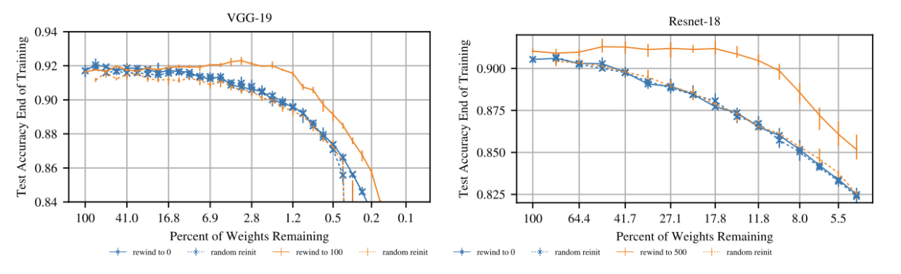

Above is a set of results presented in the original paper. Here we see the performance of deep
models in which standard LTH was used, rewinding was used, and reinitialization was used. As
we can see, standard LTH did not work, and only performed as well as random reinitialization
did. Meanwhile, rewinding had performed significantly better, supposedly solving the problem
where LTH was not working with deeper neural network models.

The concept of rewinding shares some similarities with RandomOut, as RandomOut also has to
deal with solving a problem that prevents deeper neural networks from training. Rewinding
addresses the lack of stability, while RandomOut addresses abandoned filters. However, while
RandomOut makes adjustments and monitors training through the entire process, Rewinding
only really interferes once, when setting the rewind point for the reinitialized weights.

---

## Drawing Early-Bird Tickets

While the Lottery Ticket Hypothesis made it possible to train fully pruned neural networks, that
still means you need to fully train and fully prune a neural network before you are able to use it.
Even then, you would have to go through the process of training and pruning the model again.
In order to find a faster method, Haoran Y., Chaojian L., Pengfei X., Yonggan F., Yue W.,
Xiaohan C., Richard B., Zhangyang W., and Yingyan L. introduced something called **Early Bird
Tickets**.

Early-Bird Tickets (or EB tickets) exist early on in the initialization of NN models. These tickets
are reliable subnetworks that can be drawn as early as ~epoch 10–40 (out of 160 on CIFAR),
while matching or beating the tickets that you would get after fully pruning a model.

In order to find these tickets, a binary mask is applied to the full dense network. Then, the model
is pruned as you normally would in LTH.

The distance between the subnetworks and their masks are then calculated using their
Hamming distance (similar to how we found the distances between the subnetworks for
stability). When the distance between the subnetworks begin to decrease, it indicates the
subnetworks changing less and less, implying that it is approaching an early bird ticket.

For better visualization, the authors plotted the distances onto a heat map.

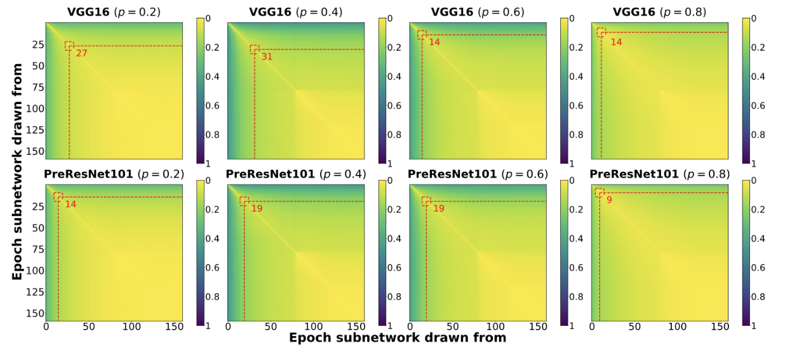

In the figures, we see that there is a point where the colors begin to change drastically from
yellow to green. The point where this change is most prominent is the indicator for where an
early bird ticket would be.

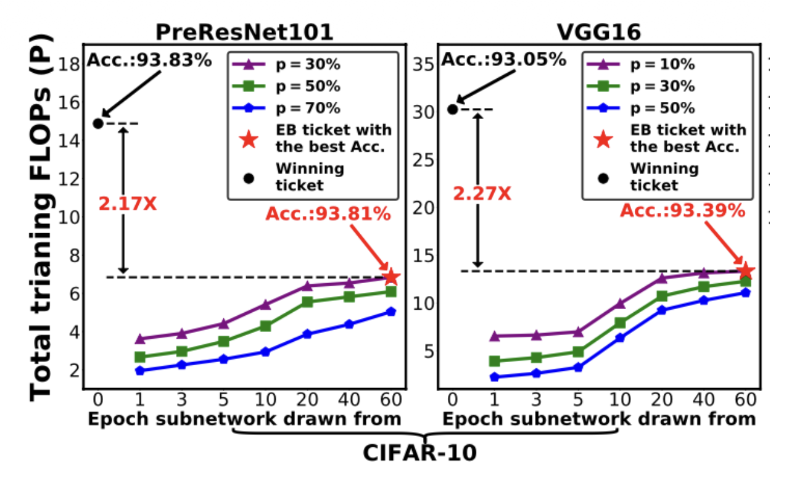

Shown here is a set of results from the paper showing the accuracy of the trained early bird
models. As we can see, the Early Bird tickets are able to not only match the accuracy of the
normal winning ticket, but they are able to do so in less than half the FLOPs (Floating Point
Operations).

EB builds up on the LTH by finding a way to cut and avoid all the extra pruning and training that
would normally be done in order to discover a winning ticket.

Although I have not found too many similarities that Early Bird Tickets have to any of the other
explored topics, EBT does have the downside of being less explored, with no guarantee that
there will be an EBT present. For example, it could be possible that taking an unlucky seed
could remove any potential tickets.

---

## Picking Winning Tickets Before Training By Preserving Gradient Flow

While the lottery ticket hypothesis allows you to train pruned models, we have to spend a
significant amount of time training and pruning the model in the first place. However, unlike the
Early Bird model, which cuts down on pruning, what if we could instead skip the training and
prune the untrained model first?

In order to solve this problem, Wang Zhang and Grosse introduce the **Gradient Signal
Preservation method (GraSP)**.

The paper proposes a pruning-at-initialization method that focuses on preserving gradient flow
in the sparse subnetwork. GraSP argues that good trainability does not depend on preserving
the loss of the gradient, but instead on preserving the magnitude and structure of gradients so
that optimization does not stall after pruning.

The way the process works is the pruning operation is added as a perturbation $\delta$ to the initial
weight of the untrained model. Taylor approximation is then used in order to characterize the
removal of weights and how the gradient flow would be impacted by it.

$$S(\delta) = \Delta L(\theta_0 + \delta) - \Delta L(\theta_0)$$

This expression is used in order to determine the importance of each weight $S(\delta)$.  
$\theta_0$ indicates the initial weights, while $\delta$ represents the change to the weights caused by pruning a weight.

For each weight, the importance can also be calculated using:

$$S(-w_i) = - w_i \cdot (H g)_i$$

where $H$ is the Hessian Matrix (matrix of the second derivatives of the loss), and $g$ is the gradient.

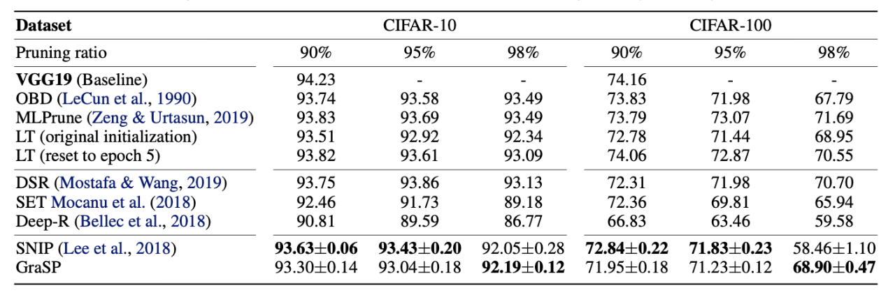

Here we have a table from the paper showing the accuracies of GraSP along with some other
models, including a method called SNIP, which prunes connections based only on how much
each individual weight impacts the initial loss, and the initial lottery ticket method.

We can see that GraSP is often equal to all other metrics, despite taking significantly less time to
process.

GraSP feels most similar to EBT, as both aim to cut a significant amount of time from the
training and pruning normally required from LTH. While GraSP predicts important connections
before training begins by analyzing gradient preservation, Early Bird Tickets still require the
model to train and prune, even if it is less than LTH, this still means that GraSP is faster.
However, EB is much cheaper to handle (no second-order computations required), and is often
more accurate.

----

# Methods

## The Lottery Ticket Hypothesis

I noticed that the lottery ticket hypothesis appeared to greatly rely on the initialization of the
model, so I wanted to perform some research to see what I could do in terms of changing the
model initialization. By changing the initialization, I wanted to know if you could change the
speed at which you would find the winning ticket, or if using a certain initialization could give you
better tickets.

## Random Out

In the previous section I mentioned how the Lottery Ticket Hypothesis appeared to contrast in its
functionality from RandomOut, where RandomOut is constantly changing the initial values in a
model to prevent abandoned filters, while Lottery Ticket Hypothesis wants to keep the original
structure.

Even so, I considered what would happen if you were to use them conjunctionally. Would they
be able to improve on each other and produce winning tickets more consistently? or would
RandomOut replacing abandoned filters mess up the way LTH works?

## Training Deep FeedForward Neural Networks

Similar to what I had said for the Lottery Ticket Hypothesis, I wanted to conduct a similar
experiment to what Glorot and Bengio did and test the Lottery Ticket Hypothesis with different
activation functions. Would there be an activation function that would give better tickets? Would
there be one that should be avoided at all costs?

## Stabilizing the Lottery Ticket Hypothesis

The idea I was most interested in from this paper was the idea of stability in the lottery tickets.
Because of this, I wanted to know how different activation functions could possibly impact the
stability of tickets. I also wanted to see how LTH with iterative pruning would work if you were to
use a different rewind checkpoint each iteration.

## Drawing Early-Bird Tickets

The idea I was most interested in from this paper was how different activation functions could
possibly impact the formation of Early Bird Tickets. Similar to what I said in my response for
Training Deep Feedforward Neural Network, would there be a best or worst activation function?
How different would they be in terms of performance? I also wanted to see how EBT would
interact with Random Out. would the performance be enhanced? would nothing happen? or
would the two methods actively interfere with each other?

## Picking Winning Tickets Before Training By Preserving Gradient Flow.

Similarly to my thoughts for all other extensions of LTH, I wanted to know how this would
interact with different activation functions. Outside of this, I wondered if GraSP would work with
LTH. For example, if you were to fully train a model with GraSP, because GraSP is an
initialization method, would it be possible to find winning tickets here as well? or would the
resulting models be too sparse to improve on?

---

# Results, Analysis and Discussion

## Experiment

For my experiments, my main objective was to evaluate the impact that different activation
functions have on pruning effectiveness, as well as the effect they had on the stability of the
models that were trained using the lottery ticket hypothesis as its base.

For the project, I used a dense, shallow CNN trained on CIFAR-10. The three activation
functions that I used were: ReLU, tanh, and sigmoid.

When pruning the models, I used two different pruning methods:

**Magnitude pruning**, which ranks weights by absolute value and retains the top \( k \) impactful
weights. This was determined using binary masks on the weights and the function:

$$m_i = \mathbf{1}(|w_i| \ge \tau_k)$$

where \($w_i$) is the value of the weight, and \( $\tau_k$) is the weight value of the \( k \)-th weight.  
(This allows us to keep the top \( k \) important/largest weights.)

**GraSP pruning**, which scores weights by their contribution to gradient flow, using the formula:

$$\text{score}_i = -w_i \cdot g_i^2$$

where $g_i$ is the gradient of the loss with respect to the weight $w_i$.

While our function for GraSP score may appear off, GraSP scores are designed to preserve
gradient flow after pruning. While the original formula involves second-order derivatives (the
Hessian Matrix), due to restricted setup, we instead adopt a first-order approximation for
computational efficiency, using the gradient instead.

Pruning masks are applied to the initial weights, and pruned models are retrained from scratch.
We evaluate performance across sparsity levels $s \in \{0.5, 0.8, 0.9\}$; meaning we check after
50%, 80%, and 90% of the weights have been pruned.

Each model is trained for 50 epochs and pruned for 20 epochs.

# Results, Analysis and Discussion

## Experiment

For my experiments, my main objective was to evaluate the impact that different activation
functions have on pruning effectiveness, as well as the effect they had on the stability of the
models that were trained using the lottery ticket hypothesis as its base.

For the project, I used a dense, shallow CNN trained on CIFAR-10. The three activation
functions that I used were: ReLU, tanh, and sigmoid.

When pruning the models, I used two different pruning methods:

**Magnitude pruning**, which ranks weights by absolute value and retains the top \( k \) impactful
weights. This was determined using binary masks on the weights and the function:

$$m_i = \mathbf{1}(|w_i| \ge \tau_k)$$

where \( w_i \) is the value of the weight, and \( \tau_k \) is the weight value of the \( k \)-th weight.
(This allows us to keep the top \( k \) important/largest weights.)

**GraSP pruning**, which scores weights by their contribution to gradient flow, using the formula:

$$\text{score}_i = -w_i \cdot g_i^2$$

where \( g_i \) is the gradient of the loss with respect to the weight \( w_i \).

While our function for GraSP score may appear off, GraSP scores are designed to preserve
gradient flow after pruning. While the original formula involves second-order derivatives (the
Hessian Matrix), due to restricted setup, we instead adopt a first-order approximation for
computational efficiency, using the gradient instead.

Pruning masks are applied to the initial weights, and pruned models are retrained from scratch.
We evaluate performance across sparsity levels \( s = \{0.5, 0.8, 0.9\} \); meaning we check after
50%, 80%, and 90% of the weights have been pruned.

Each model is trained for 50 epochs and pruned for 20 epochs.

---

## Results and Analysis

For our results, we have 4 different sets of graphs.

---

## Validation Accuracy vs. Sparsity

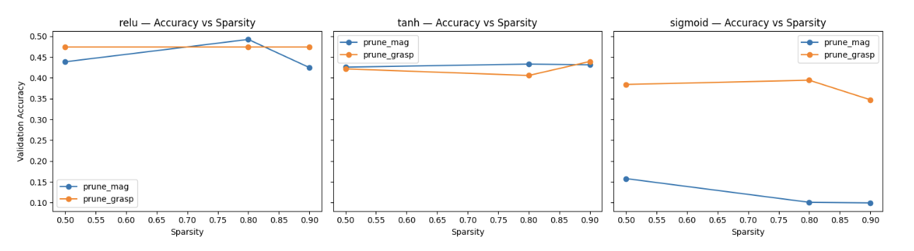

This graph tells us about the validation accuracy of each of our pruned models at each of our
checkpointed sparsity levels (50%, 80%, 90%).

We can see that for the **ReLU** activation function, the magnitude pruning peaks at 0.8 sparsity,
only to drop by a decent margin at 0.9 sparsity. Meanwhile, the accuracy with GraSP is
unchanging, and stays consistent across all sparsities.

For **Tanh**, we can see that both magnitude pruning and GraSP pruning had relatively equal
accuracy results, however, the accuracy for GraSP pruning was slightly lower than that of
magnitude pruning until 0.9 sparsity. We can also see that the Tanh models both had lower
accuracies than the two ReLU models.

For **Sigmoid**, the GraSP pruning greatly outperformed the magnitude pruning; this was likely
caused by oversaturating due to the highly volatile nature of sigmoid's gradients.

---

## Mask Sparsity vs Target Sparsity

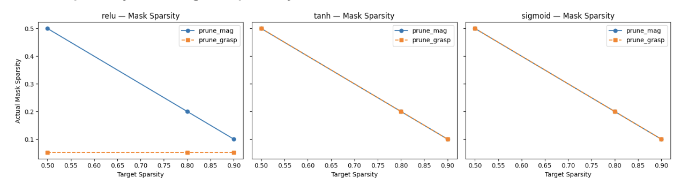

This graph shows how close the actual sparsity of the pruning mask is to the intended target
sparsity.

For **ReLU**, GraSP pruning failed to prune the model, as the actual sparsity remained around
0.05 regardless of the target sparsity. Magnitude pruning, however, was able to prune the model
correctly.

For **Tanh** and **Sigmoid**, both magnitude pruning and GraSP pruning were able to prune the
models correctly, with the actual sparsity matching the target sparsity.

---

## Stability vs Sparsity

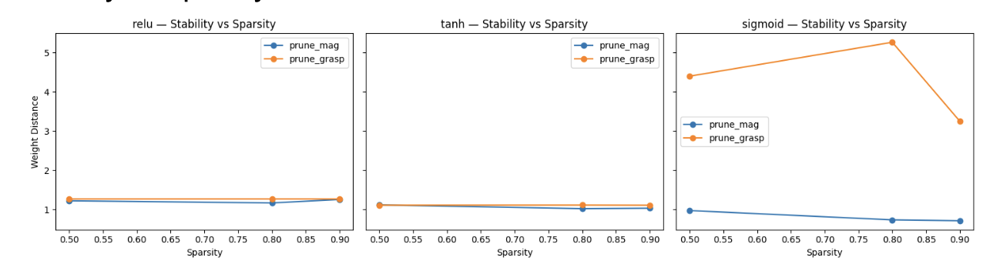

This graph shows the stability of the pruned models at each sparsity level. Stability is measured
using the following equation:

$$D = \frac{\|W_{\text{dense}} - W_{\text{pruned}}\|_2}{\|W_{\text{dense}}\|_2}$$

For **ReLU**, both magnitude pruning and GraSP pruning had similar stability values, with both
remaining relatively stable across all sparsity levels.

For **Tanh**, both pruning methods again had similar stability values, with both remaining stable
across all sparsity levels.

For **Sigmoid**, magnitude pruning remained stable, however, GraSP pruning had a large spike
in instability at 0.8 sparsity. This was likely caused by the highly volatile nature of sigmoid's
gradients.

---

## Training Curves — ReLU

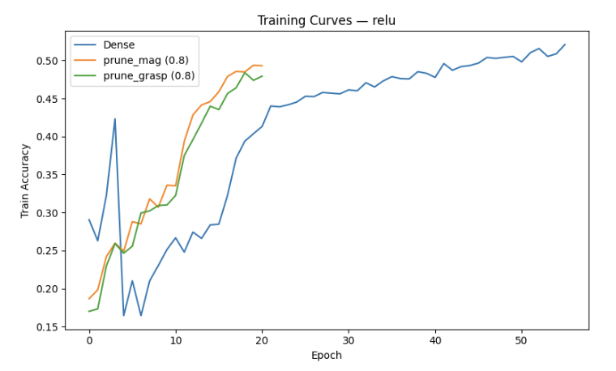

This graph shows the training accuracy of the dense model, the magnitude-pruned model, and
the GraSP-pruned model for the ReLU activation function.

Both pruned models initially outperform the dense model in terms of training accuracy,
especially in the early epochs. However, the dense model eventually catches up and surpasses
the pruned models in later epochs.

---

## Training Curves — Tanh

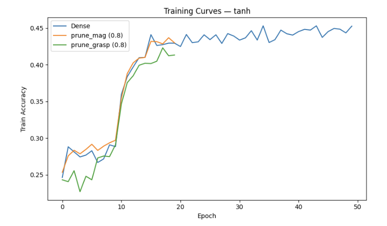

This graph shows the training accuracy of the dense model, the magnitude-pruned model, and
the GraSP-pruned model for the Tanh activation function.

All three models start with similar accuracy and improve significantly around epoch 10. The
dense model achieves the highest training accuracy overall, while the pruned models show
slightly lower performance.

---

## Training Curves — Sigmoid

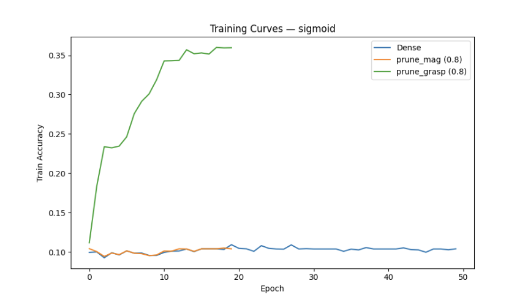

This graph shows the training accuracy of the dense model, the magnitude-pruned model, and
the GraSP-pruned model for the Sigmoid activation function.

The dense and magnitude-pruned models both fail to learn, with accuracy remaining around
0.10. Meanwhile, the GraSP-pruned model shows a significant increase in accuracy, reaching
above 0.35 by epoch 20 and then plateauing.

---

# Bibliography

**The Lottery Ticket Hypothesis: Finding Sparse, Trainable Neural Networks**  
Jonathan Frankle, Michael Carbin  
URL: https://iclr.cc/Conferences/2019/Schedule?showEvent=1156  

**Randomout: Using a convolutional gradient norm to win the filter lottery.**  
Joseph Paul Cohen, Henry Z Lo, and Wei Ding.  
URL: https://arxiv.org/abs/1602.05931  

**Understanding the difficulty of training deep feedforward neural networks**  
Xavier Glorot, Yoshua Bengio  
URL: https://proceedings.mlr.press/v9/glorot10a/glorot10a.pdf  

**Stabilizing the Lottery Ticket Hypothesis**  
Jonathan F., Gintare K. D., Daniel M. R., Michael C.  
URL: https://arxiv.org/abs/1903.01611  

**Drawing Early-Bird Tickets: Towards More Efficient Training of Deep Networks**  
Haoran Y., Chaojian L., Pengfei X., Yonggan F., Yue W., Xiaohan C., Richard B., Zhangyang W., Yingyan L.  
URL: https://arxiv.org/abs/1909.11957  

**Deconstructing Lottery Tickets: Zeros, Signs, and the Supermask**  
Hattie Zhou, Janice Lan, Rosanne Liu, Jason Yosinski  
URL: https://arxiv.org/abs/1905.01067  

**PICKING WINNING TICKETS BEFORE TRAINING BY PRESERVING GRADIENT FLOW**  
Chaoqi Wang, Guodong Zhang, Roger Grosse  
URL: https://arxiv.org/abs/2002.07376  

